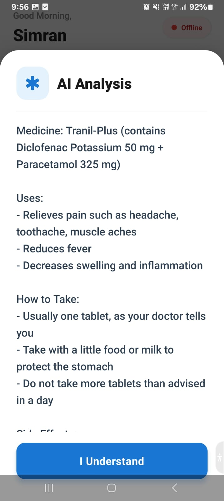
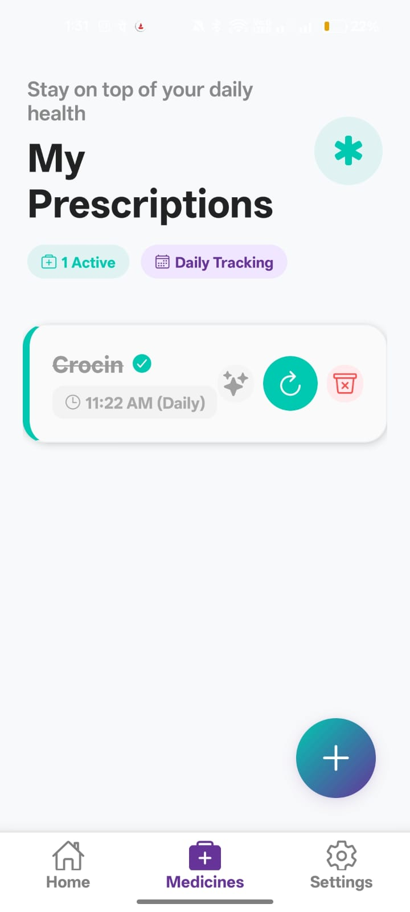
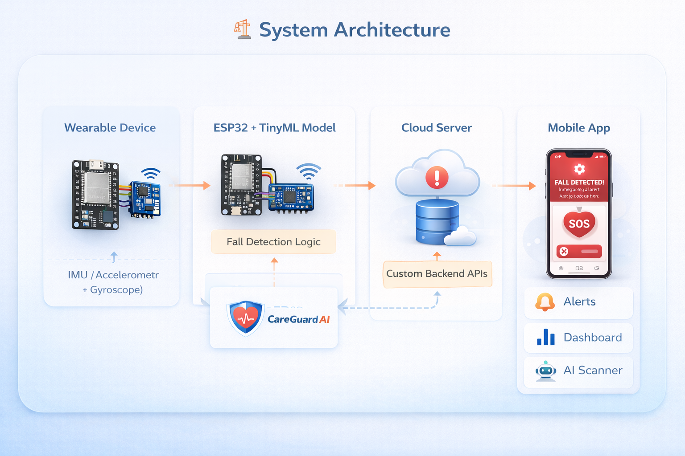

<!-- ================= HEADER ================= -->
<h1 align="center">🛡️ CareGuard AI</h1>
<h3 align="center">Smart Fall Detection & Daily Assistance System for Elderly</h3>

<p align="center">
  
</p>

---

<!-- ================= BADGES ================= -->
<p align="center">
  
  
  
  
  
</p>

<p align="center">
  
  
  
</p>

---

<!-- ================= BANNER ================= -->
<p align="center">
  
</p>

---

## 🚀 Overview  

CareGuard AI is an **IoT + AI-based healthcare solution** designed to ensure the safety and independence of elderly individuals.

### 🔥 Key Features
- 🚨 Real-time fall detection  
- 📲 Instant alerts  
- 💊 Medication reminders  
- 💧 Hydration tracking  
- 🤖 AI prescription assistant  
- 📊 Health dashboard  

---

## ❗ Problem Statement  

- Falls are a major cause of injury among elderly  
- Delay in response can be dangerous  
- Lack of real-time monitoring  

👉 A **smart automated system** is required  

---

## 💡 Solution  

CareGuard integrates **hardware + AI + mobile app**:

- 📡 ESP32 + MPU6050 wearable  
- 🧠 TinyML model for fall detection  
- 📱 Mobile app for monitoring  
- ☁️ Cloud alerts system  

---

## 🎬 Demo (Add GIF Here)

<p align="center">
  
</p>

---

## 🧠 AI Model  

- Model: **1D CNN (TinyML)**  
- Input: **6-axis IMU data**  
- Window: **100 samples (~2 sec)**  
- Output: **Fall probability**  

⚡ Optimized using TensorFlow Lite  

---

## ⚙️ Tech Stack  

| Category | Tech |
|--------|------|
| Hardware | ESP32, MPU6050 |
| AI/ML | TensorFlow Lite |
| App | React Native |
| Backend | Node.js |
| Database | Neon DB |
| APIs | Blynk, WhatsApp |

---

## 📊 Dataset  

- **WEDA-FALL Dataset**  
- 50Hz sampling  
- Real-world wrist-based data  
- Age: 20–95  

## 📸 App Screenshots  

<div align="center" style="overflow-x: auto; white-space: nowrap;">
  
  
  
  
  
  
</div>
## 🔌 Hardware Setup  


---

## 🏗️ System Architecture  

<p align="center">
  
</p>

---

## 📁 Project Structure  

```bash
Minor Project/
├── CareGuard/
├── CareGuard-Backend/
├── esp32_ml_project/
├── images/
└── README.md
